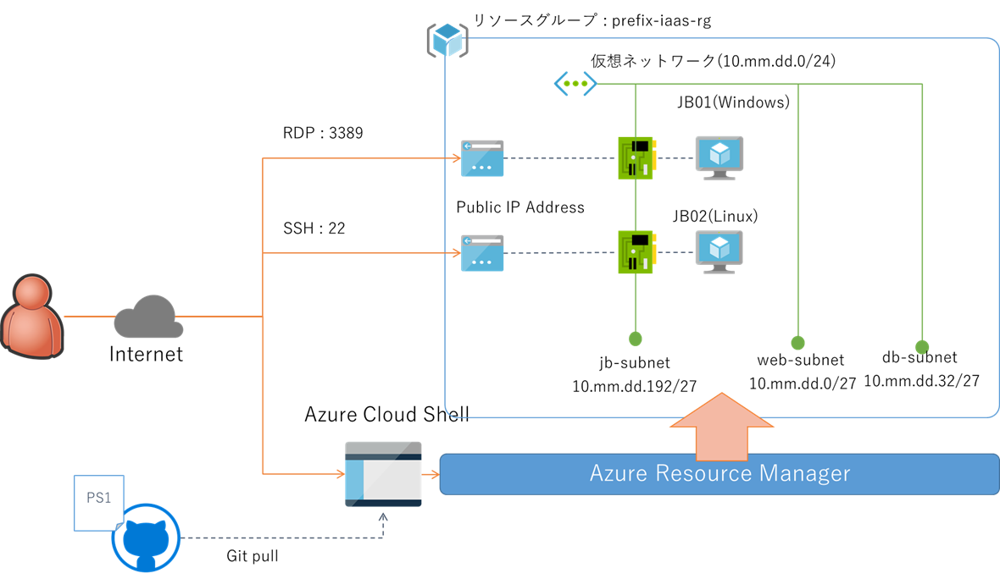
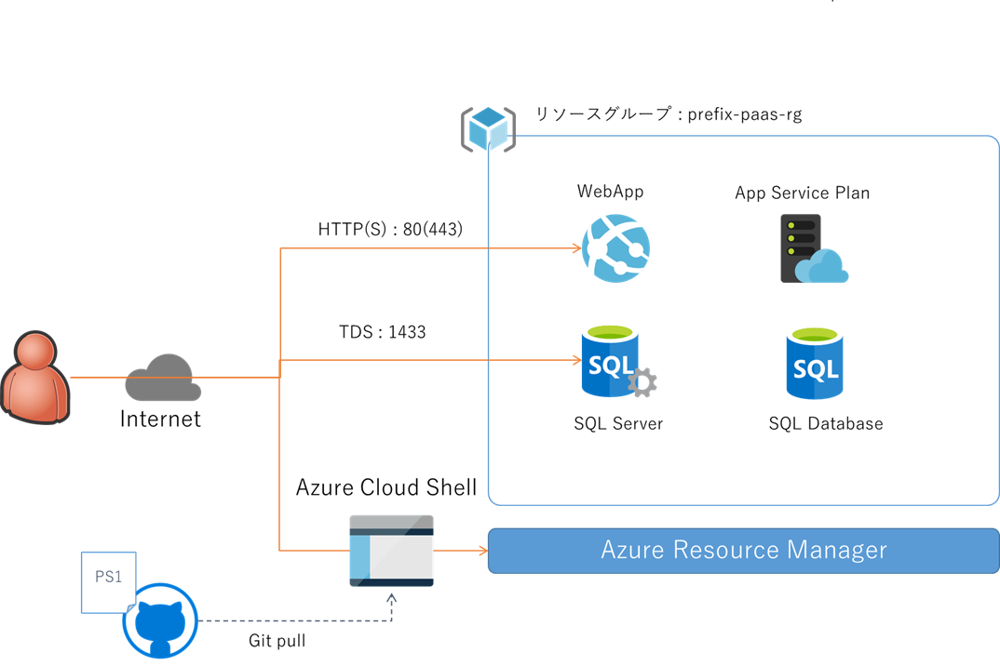

# azure-infra-provisioning

## 準備

Microsoft Azure 上のリソースをスクリプト操作するためのデモ資源です。
Azure Cloud Shell ないしは Azure PowerShell で本リポジトリをクローンして利用します。

```powershell
PS> git clone https://github.com/ayuina/azure-infra-provisioning.git
PS> cd azure-infra-provisioning
```

必要に応じて Azure Active Directory へのサインイン、および使用するサブスクリプションを選択します

```powershell
PS> Connect-AzAccount
PS> Select-AzSubscription -Subscription 'subscription guid'
```

## Infrastructure as a Service 構築デモ



１つのリソースグループ内に仮想ネットワークを３つ作成し、サブネット内に Windows と Linux の２つの仮想マシンを構築します。

```powershell
PS> .\demo-iaas.ps1 -name *yourPrefix* -region *regionName*
```

スクリプトを実行するとユーザー名とパスワードの入力を促されますが、これは仮想マシンの管理者アカウントとして利用されます。
どちらの仮想マシンもインスタンスレベルのパブリック IP アドレスを持たせていますので、インターネット経由でログイン可能です。


## Platform as a Service 構築デモ



１つのリソースグループ内に Web App と SQL Database を構築します。

```powershell
PS> .\demo-paas.ps1 -name *yourPrefix* -region *regionName*
```

スクリプトを実行するとユーザー名とパスワードの入力を促されますが、これは SQL Database の管理者アカウントとして利用されます。
SQL Server にはファイアーウォールに許可設定をしていませんので、すべての接続が拒否されます。
実際に SQL アクセスをする際には事前にクライアントの接続 IP アドレスをファイアーウォールで許可してください。
